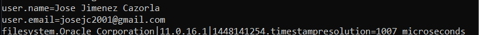
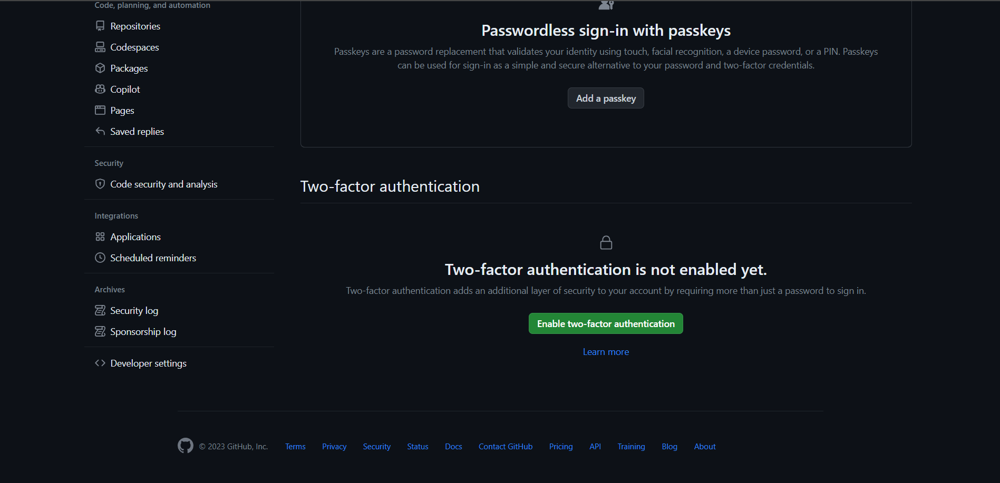
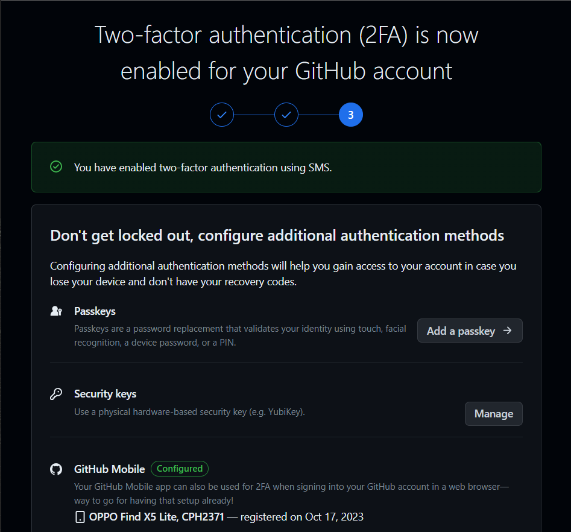
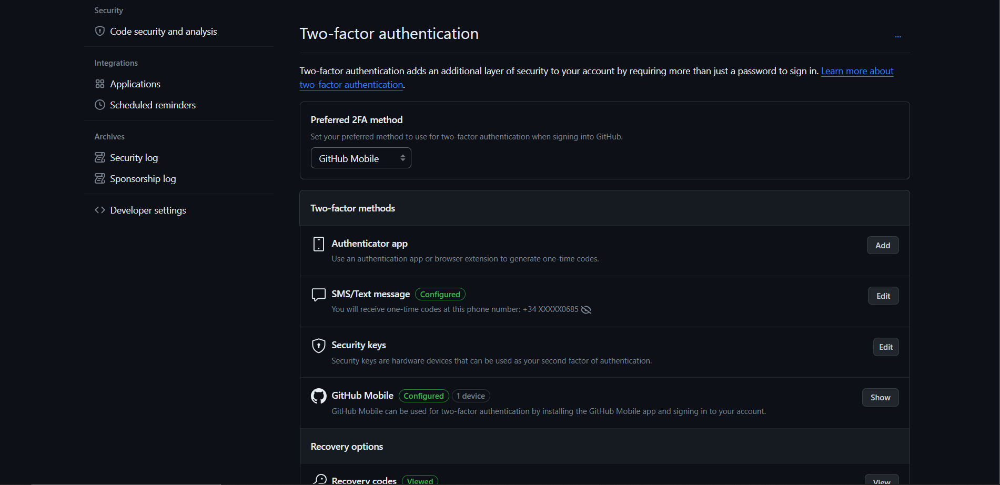

## Configuración del entorno de trabajo :gear:
A continuación, se van a detallar cada uno de los pasos llevados a cabo para completar la configuración del entorno de trabajo, usando git y GitHub.

### 1. Creación de repositorios
Suponiendo que tenemos ya una cuenta de GitHub, nos disponemos a crear los repositorios necesarios para este proyecto.
- [Fork del Repositorio de Cloud Computing 23-24](https://github.com/Josejc2001/CC-23-24)
- [Repositorio del Proyecto - RoyalFantasy](https://github.com/Josejc2001/MUII_CC-23-24)

Cuando tenemos disponibles los repositorios, es necesario disponer de ellos en local. Para ello hay dos opciones.
* Usando el cliente de escritorio disponible de GitHub -> [GitHub Desktop](https://desktop.github.com/)
* Por línea de comandos (teniendo git instalado)
```
$ git clone https://github.com/Josejc2001/MUII_CC-23-23
```
### 2. Configuración perfil personal GitHub
En cuanto a la configuración del perfil, se ha creado una Overview que permite a los usuarios que visiten mi perfil y conozcan más acerca de mi.


Para comprobar la correcta asociación de un nombre y correo electrónico en nuestra cuenta, vamos a ejecutar el siguiente comando en la consola.
```
$ git config --list
```



### 3. Creación de claves SSH
A continuación, se explica como se han de crear un par de claves público/privada para poder conectarse con el repositorio de GitHub mediante SSH.

Primero, hay que generar las claves con el siguiente comando:
```
$ ssh-keygen -t rsa -b 4096 -C "josejc2001@gmail.com"
```

Posteriormente abrimos una consola con permisos de administrador y lanzamos el agente ssh en segundo plano.
```
# start the ssh-agent in the background
Get-Service -Name ssh-agent | Set-Service -StartupType Manual
Start-Service ssh-agent
```

Por último añadimos la clave privada SSH al agente ssh con el siguiente comando:
```
ssh-add C:\Usuarios\josej/.ssh/id_rsa
```

### 4. Activación de segundo factor de autenticación
Para terminar la configuración, vamos a añadir una autenticación de dos factores. Para ello hay que dirigirse al apartado de *Settings>Password and authentication* y ahí aparecerá la siguiente sección, la cual debemos habilitar.



En la siguiente imagen se puede apreciar como el proceso de autenticación se ha realizado correctamente.



Actualmente tengo varias posibilidades para el segundo factor de autenticación como se puede apreciar en la siguiente imagen.




