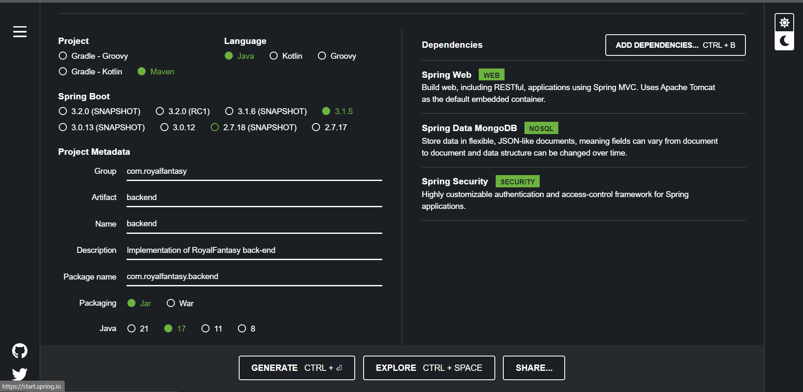
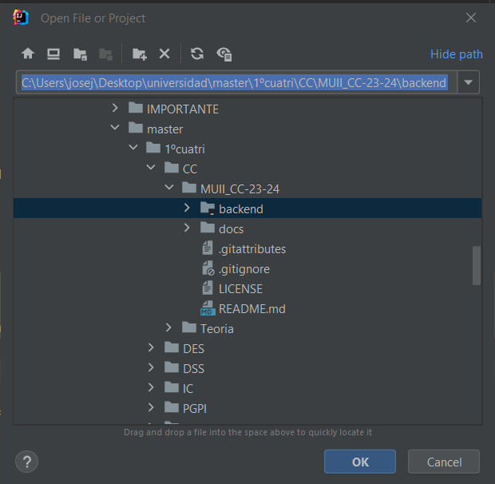
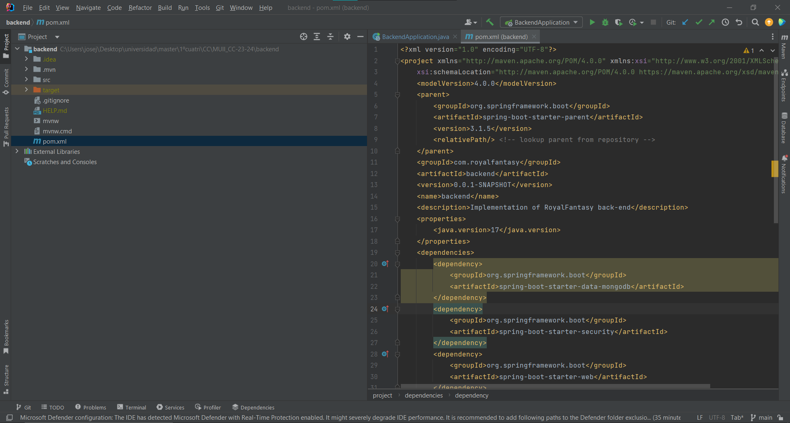
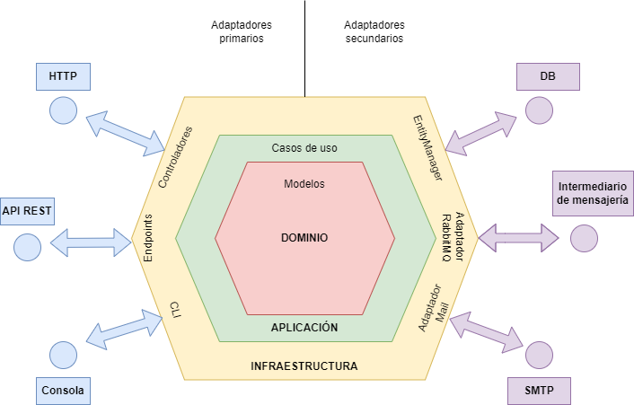

# Hito 1 :pushpin:
> Versión 0.0.1

## Contenidos
Los contenidos de este hito serán los siguientes:
- [Historias de usuario](#historias-de-usuario)
- [Milestones](#milestones)
- [Instalación](#instalación)
- [Justificación de lenguajes, frameworks y arquitectura](#justificación-de-lenguajes-y-frameworks)
- [Arquitecturas](#arquitecturas)

## Historias de usuario

## Milestones

## Instalación
En primer lugar para llevar a cabo la instalación, hay que dirigirse a la página de [Spring Initializr](https://start.spring.io/), la cual nos permitirá generar la estructura inicial de nuestro proyecto.

Como se puede apreciar en la anterior imagen, hemos ajustado los parámetros correctos con algunas dependencias necesarias, aunque son modificables a posteriori.

Para generar el archivo .zip que contiene el proyecto, hay que pulsar el botón *Generate*.

A continuación, abrimos/descargamos el IDE que vayamos a utilizar e importamos el proyecto creado anteriormente. En mi caso, [IntelliJ IDEA](https://www.jetbrains.com/idea/).

Una vez importado el proyecto, el IDE nos identificará Maven, que es el gestor de paquetes que vamos a utilizar, e instalará todas las dependencias necesarias para la ejecución del proyecto. También añadirá un Servidor Tomcat para lanzar la aplicación y debemos asegurarnos que el JDK es el correcto para evitar errores.

## Justificación de lenguajes y frameworks
En este apartado se va a justificar la elección de cada lenguaje, framework y arquitectura general del sistema.

### Justificación de lenguajes
En primer lugar, los lenguajes que vamos a utilizar para el desarrollo de este sistema son [Java](https://www.java.com/es/) y [TypeScript](https://www.typescriptlang.org/), de forma respectiva para el back-end y el front-end.

La utilización de Java como lenguaje para la implementación del back-end viene dada por ser el lenguaje más usado y popular actualmente. Hay una serie de características fundamentales que le hacen consagrarse en la cúspide:

- **Simplicidad:** Su forma de codificar es limpia y de fácil entendimiento.
- **Compilado e interpretado:** Ofrece el poder de los lenguajes compilados junto con la
flexibilidad que aportan los interpretados.
- **Orientado a objetos:** Facilita la reutilización de código.
- **Robusto:** Un gran manejo de errores en tiempo de ejecución y de las excepciones.

Debido a estas características y a la versatilidad que ofrece para realizar cualquier tipo de aplicación, es la principal herramienta a utilizar para el desarrollo de este proyecto.

Para el desarrollo de la parte frontal del sistema, vamos a utilizar TypeScript. Este lenguaje está construido a un nivel superior de JavaScript. Por tanto ofrece una serie de características adicionales que lo hace más limpio y sólido. El uso de este lenguaje también nos permitirá hacer un código seguro, escalable.

### Justificación de frameworks
En cuanto a los frameworks que vamos a utilizar para el desarrollo de Royal Fantasy, tenemos [Spring](https://spring.io/) para la implementación del backend junto con el lenguaje Java, anteriormente mencionado, y [Angular](https://angular.io/) para el desarrollo del front-end.

Con respecto a Spring, es un framework desarrollado para el trabajo con Java como lenguaje de programación. Está en pleno crecimiento de popularidad ya que hay muchos desarrolladores que lo usan para el backend de sus proyectos. Además es una herramienta que busca que los programadores se centren más en el propio código que en cualquier paso de configuración y/o despliegue.

En cuanto a la configuración, ofrece la posibilidad de definir las necesidades del proyecto que quieres realizar durante el proceso de inicialización, mediante las dependencias de iniciador también llamadas Spring Starters.

Junto con la facilidad de configuración y que está basado en Java, se convierte en la herramienta ideal para implementar el back-end de este sistema.

Por otro lado, Angular junto con el lenguaje en el que se basa, TypeScript, ofrecen un rápido y eficiente proceso de desarrollo, compatibilidad de navegadores y sistemas
operativos y modularidad.

Además, es un sistema que posee enlace bidireccional de datos, directivas, pruebas junto con un futuro próspero, debido a su funcionalidad y popularidad.

## Arquitecturas
Para el diseño de este sistema, se van a utilizar dos arquitecturas muy conocidas las cuales vienen detalladas a posteriori.

### Arquitectura Hexagonal
Para el diseño del back-end, nos hemos decantado por utilizar la **Arquitectura Hexagonal** ya que la he utilizado para otros sistemas y creo que es la mejor opción para este desarrollo.

Esta arquitectura propone dividir el sistema en diversas capas, las cuales tendrán su propia responsabilidad junto con una evolución aislada y facilidad de testear.

Para lograr esta independencia entre las capas surgen dos conceptos importantes, que también dan nombre a esta arquitectura diseñada por Alistair Cockburn, y son los puertos y adaptadores. Un **puerto** se define como el punto de entrada y salida de la aplicación, mientras que un **adaptador** es el que implementa la conexión con el puerto y otros servicios.

Podemos diferenciar entre dos clases de puertos y adaptadores: primarios y secundarios. Los primarios son aquellos en los que el usuario desencadena su acción, es decir, mediante una interfaz de usuario, se realiza una solicitud al sistema. En cuanto a los puertos y adaptadores secundarios, son los responsables de atender peticiones del sistema.

A continuación, se muestra un diagrama que representa los puertos y adaptadores primarios y secundarios que puede tener un sistema junto con sus tres capas fundamentales explicadas seguidamente.

Como se puede apreciar en el diagrama hexagonal, tenemos tres capas claramente
diferenciadas:
- **Capa de dominio:** Es la capa central del hexágono y su función es alojar la lógica de negocio. En ella se encuentran los modelos de datos y sus restricciones. Esta capa es independiente del resto de capas y de las tecnologías utilizadas. Su forma de comunicación es a través de las interfaces definidas en ella.
- **Capa de aplicación:** Por encima de la capa de dominio se encuentra la capa de aplicación, en la cual se encuentra la lógica de la aplicación. Se coordinan las acciones y los servicios del dominio con el objetivo de cumplir con casos de uso específicos.
- **Capa de infraestructura:** Es la capa más exterior del hexágono y es en la que se hallan las implementaciones o adaptaciones de los puertos de las demás capas. Los adaptadores son los encargados de conectar la lógica de negocio y de la aplicación con los servicios externos a nuestra aplicación. En el caso de mi implementación, aquí se encuentran el servicio REST, la base de datos y algunos archivos de configuración que permiten el correcto funcionamiento de los frameworks.
- **Capa de puertos:** Como ya se ha mencionado anteriormente, esta capa define las interfaces a través de las cuáles el sistema se comunica con el exterior.