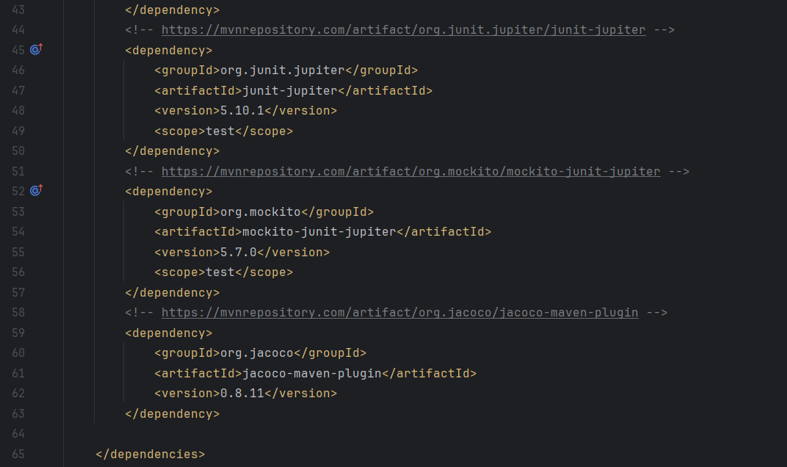
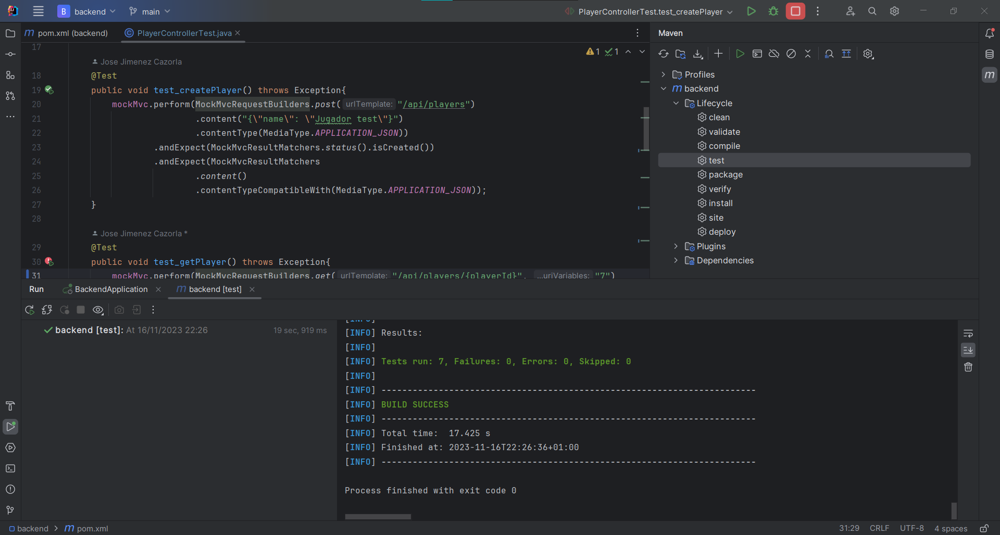

# Configuración de Spring y Maven para testing
## Dependencias en el pom.xml
Para implementar un correcto entorno de testeo, es necesario añadir las dependencias que se observan en la siguiente imagen.

> Estas dependencias se pueden encontrar en el repositorio de maven: https://mvnrepository.com/

## Maven test
Nuestro IDE dispone de un plugin que permite la automatización de test con maven a la perfección.

Como se puede apreciar en esta imagen, hay un desplegable a la derecha de la pantalla que ofrece una opción de *test* que permitirá la ejecución de todos los tests disponibles en el proyecto.

Como resultado, se puede apreciar en la consola de la parte inferior, todos los test han sido superados.