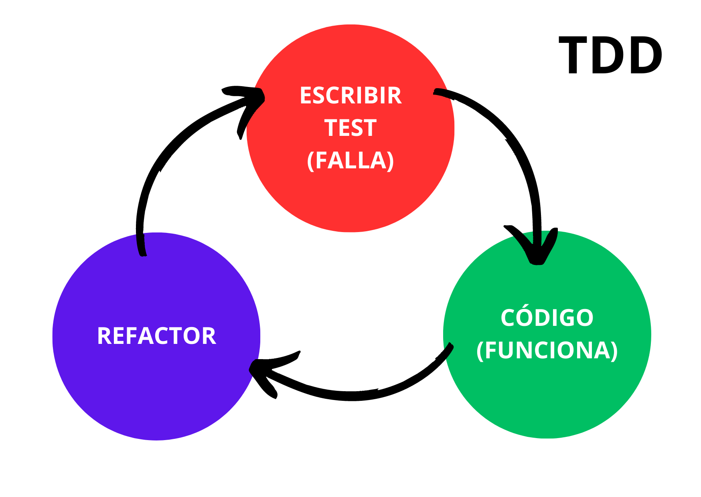

# Hito 2 :pushpin:
> Versión 2.0.0

## Contenidos
Los contenidos de este hito serán los siguientes:
- [Gestores de tareas](#gestores-de-tareas)
- [Marcos de pruebas](#marcos-de-pruebas)
- [Bibliotecas de aserciones](#bibliotecas-de-aserciones)

## Gestores de tareas
Para llevar a cabo la realización de este proyecto, se escogerá [Maven](https://maven.apache.org/) como gestor de tareas del backend y [NPM](https://www.npmjs.com/) como gestor de tareas del frontend. Estos gestores de tareas han sido escogidos por su facilidad de uso y su integración en los frameworks utilizados.

### Maven
Apache Maven es una potente herramienta de gestión de proyectos que se utiliza para gestión de dependencias, herramienta de compilación y para documentación. Un aspecto importante es que es de código abierto y gratuita.

Se puede usar con diversos lenguajes pero principalmente se usa en proyectos Java. De hecho, el framework que se va a utilizar para el desarrollo del backend, Spring Boot, utilizan esta herramienta por defecto.

Por ejemplo, para automatizar la ejecución de test podemos usar el siguiente comando:
```
$ mvn test
```

### NPM
NPM significa Node Package Manager o Gestor de Paquetes de Node. Es una herramienta que te permite instalar, actualizar y administrar fácilmente los paquetes de Node.js.

Se va a utilizar npm ya que permite instalar todos los paquetes necesarios para nuestro framework Angular, que se va a utilizar para la implementación del front-end.

El archivo package.json es crucial ya que contiene los metadatos y las dependencias de tu proyecto. Por ejemplo, nos permite ajustar y lanzar los test utilizando el siguiente comando:
```
$ npm run test
```

### Metodología TDD
TDD o Test Driven Development es una práctica de programación que trata de comenzar escribiendo las pruebas en primer lugar, posteriormente escribir el código fuente, pasar la prueba correctamente y terminar con la refactorización del código escrito.

El objetivo de seguir esta metodología o técnica en este proyecto es conseguir un código más robusto, mejorando su calidad, así como obtener un desarrollo software modular y con facilidad de incluir nuevas funcionalidades al código.


> La imagen ha sido extraida de la siguiente página: https://rubentejera.com/algoritmo-tdd/


## Marcos de pruebas
A continuación, se explica la elección del framework [JUnit](https://junit.org/junit5/) para la automatización de pruebas del backend y del framework [Cypress](https://www.cypress.io/) para el testeo del frontend.

### JUnit
Como ya se ha mencionado anteriormente, JUnit será el marco de pruebas que utilizaremos en el backend. Este framework permite la ejecución de clases de manera controlada, para probar así el correcto funcionamiento de los métodos implementados.

Además, JUnit dispone de distintas funcionalidades para realizar tanto pruebas unitarias como pruebas de integración. Por esto, y la fácil integración con Spring he decidido utilizar este framework de pruebas.

### Cypress
Para testear el front-end de nuestro sistema, utilizaremos Cypress. Este framework es un componente de código abierto que nos brinda la posibilidad de escribir pruebas automatizadas de una manera eficiente, rápida, confiable y muy sencilla.

Al igual que JUnit, Cypress permite la creación de pruebas unitarias, de integración y extremo a extremo. Se va a utilizar este framework porque está diseñado especialmente para manejar uno de los frameworks de JavaScript modernos, como es Angular, framework que utilizaremos en el desarrollo de la parte frontal de nuestro sistema.

## Bibliotecas de aserciones


