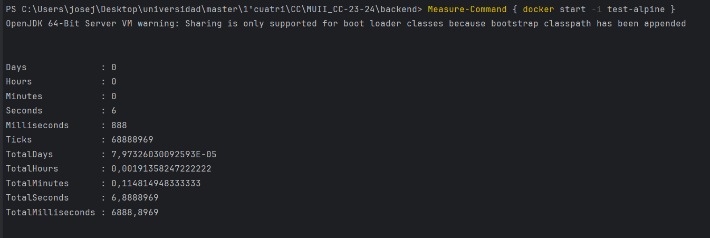

## Elección del contenedor base
Para llevar a cabo la elección del contenedor base a utilizar para los tests implementados en el hito anterior y teniendo en cuenta los lengujes y frameworks empleados, tendremos que realizar una comparación con las distintas opciones de imágenes que nos valdrían. Los criterios de selección que seguiremos para tomar la decisión serán el tamaño de la imagen, tiempo de ejecución, funcionalidad y características incluidas.

Las distintas opciones que se han contemplado en la elección del contenedor base son las siguientes:
- [Imagen eclipse-temurin:17-jdk-focal](#imagen-eclipse-temurin17-jdk-focal)
- [Imagen eclipse-temurin:17-jdk-alpine](#imagen-eclipse-temurin17-jdk-alpine)

### Imagen eclipse-temurin:17-jdk-focal
Se trata de una imagen que se basa en la distribución de Ubuntu Focal Fossa (20.04LTS) y que incluye el kit de desarrollo de java (JDK) 17 de Eclipse Temurin.

Ubuntu Focal es una distribución de propósito general y esta imagen proporciona un entorno de ejecución Java sobre esa base.

#### Construcción de Dockerfile
El Dockerfile construido consiste en cargar la imagen base, establecer el directorio de trabajo, copiar los archivos relacionados con Maven, descargar las dependencias de Maven necesarias, copiar el código fuente de la aplicación y por último, ejecutar el comando para ejecutar los tests.

```Dockerfile
FROM eclipse-temurin:17-jdk-focal

WORKDIR /backend

COPY .mvn/ .mvn
COPY mvnw pom.xml ./
RUN ./mvnw dependency:go-offline

COPY src ./src

CMD ["./mvnw", "test"]
```

### Imagen eclipse-temurin:17-jdk-alpine
Se trata de una imagen que se basa en Alpine Linux, una distribución de Linux ligera y minimalista, la cual incluye JDK 17 de Eclipse Temurin.

Alpine Linux es conocido por ser compacto y eficiente, lo que resulta en imágene de contenedor más pequeñas en comparación con distribuciones más grandes de Ubuntu.

#### Construcción de Dockerfile
La construcción del Dockerfile es similar al anterior, cambiando unicamente la imagen base del contenedor.

```Dockerfile
FROM eclipse-temurin:17-jdk-alpine

WORKDIR /backend

COPY .mvn/ .mvn
COPY mvnw pom.xml ./
RUN ./mvnw dependency:go-offline

COPY src ./src

CMD ["./mvnw", "test"]
```

### Justificación de elección del contenedor base
Para escoger el mejor contenedor base para este proyecto, concretamente para la ejecución de los test, tendremos en cuenta las siguientes características:
- **Tamaño de las imágenes**
- **Tiempo de ejecución**

En cuanto al tamaño de las imágenes, se puede observar en la siguiente imagen:


Se puede apreciar como la imagen que tiene como base un Alpine Linux, es más ligera que la que contiene como base un Ubuntu focal.

Para ver quien se lleva el veredicto final, se ha comprobado el tiempo que tarda en ejecutarse un contenedor construido a partir de la imagen de Alpine Linux y otro de la imagen de Ubuntu focal de la siguiente forma:




Como se puede observar los tiempos de ejecución son muy similares, así que tomaremos como base el contenedor construido a partir de la imagen de  **Alpine Linux**.


