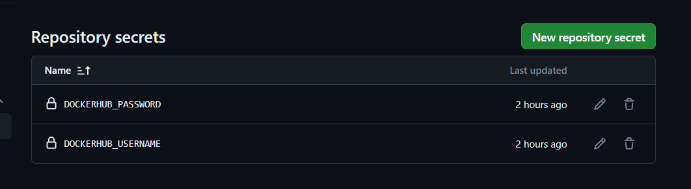

## Subida de contenedor a DockerHub
Tras la construcción del contenedor en local, vamos a realizar la subida a DockerHub, repositorio de imágenes docker que nos permitirá compartir las imágenes construidas.

Para realizar esta subida de forma automática, se ha implementado un [Workflow](../../.github/workflows/docker.yml) actualizar la imagen del contenedor alojado en Docker Hub.

### Explicación del Workflow
En primer lugar, se lanzará cada vez que se realiza un _push_ sobre la rama principal, en esta caso sobre la rama _main_, lo cual se indica mediante las siguientes instrucciones:

```
on:
  push:
    branches: [ main ]
```

A continuación, es necesario establecer el nombre de usuario y la contraseña de DockerHub en el apartado llamado **Repository secrets** de nuestro repositorio, lo que nos permitirá acceder a DockerHub de manera segura sin revelar datos secretos.



Posteriormente, se define un único **job** que se ejecutará sobre la máquina de **ubuntu-latest** y que realizará los siguientes pasos:

1. Nos situamos sobre nuestro repositorio.

```
- name: Check out the repo
        uses: actions/checkout@v2
```
2. Iniciamos sesión en DockerHub mediante los **secrets** anteriormente configurados.

```
- name: Log in to Docker Hub
        uses: docker/login-action@v1
        with:
          username: ${{ secrets.DOCKERHUB_USERNAME }}
          password: ${{ secrets.DOCKERHUB_PASSWORD }}
```
4. Se extraen los metadatos de la imagen que se va a publicar. Para ello, se hace uso de la _action_ **docker/metadata-action** que permite poder pasárselos a la _action_ que construye y publica la imagen.

```
- name: Extract metadata (tags, labels) for Docker
        id: meta
        uses: docker/metadata-action@v3
        with:
          images: josejc01/contenedor-test-alpine
          tags: latest
```
5. Se construye la imagen y se publica en DockerHub. Para ello, se hace uso de la _action_ **docker/build-push-action**, la cual construye la imagen a partir del archivo Dockerfile. Además, se utiliza **_context_** para buscar este Dockerfile y sus archivos asociados en el directorio raíz de nuestro repositorio. Más tarde, puesto que **_push_** es igual a **_true_**, la imagen será publicada.

```
- name: Build and push Docker image
        uses: docker/build-push-action@v2
        with:
          context: .
          push: true
          tags: ${{ steps.meta.outputs.tags }}
          labels: ${{ steps.meta.outputs.labels }}
```
7. Por último, se lanzan los tests del contenedor de manera automática en caso de existir.

```
- name: Run docker tests
        run: docker run josejc01/contenedor-test-alpine
```

Para finalizar este proceso, se puede observar como en nuestro DockerHub está publicada correctamente la imagen.


