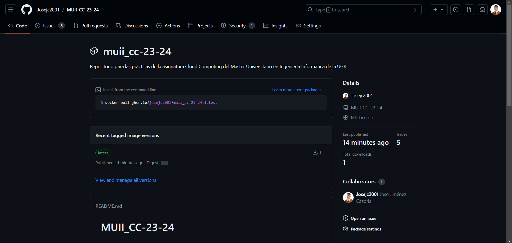

## Uso de GitHub Container Registry

GitHub Container Registry almacena imágenes de contenedores dentro de nuestra cuenta de GitHub y permite asociar una imagen a un repositorio, como es el caso de estudio.  De esta manera, se puede consultar el paquete generado por el desplieque del contenedor en GitHub Container Registry [aquí](https://github.com/Josejc2001/MUII_CC-23-24/pkgs/container/muii_cc-23-24)

Para la actualización automática, al igual que en el caso anterior de **DockerHub**, debemos crear un [Workflow](../../.github/workflows/github-container-registry.yml) que nos permita realizar esta actualización.

### Explicación del Workflow
Los pasos seguidos para construir el workflow son similares al anterior para el DockerHub. La única diferencia es que se hace el inicio de sesión en **GitHub Container Registry**:

```
- name: Login to GitHub Container Registry
uses: docker/login-action@v1
with:
    registry: ghcr.io
    username: ${{ github.actor }}
    password: ${{ secrets.GITHUB_TOKEN }}
```

Se hacen uso de las variables y secretos que nos ofrece GitHub para que el login sea existoso.

Como resultado de implementar este workflow, obtenemos que se crea Package correspondiente y se puede apreciar en la siguiente imagen: 


