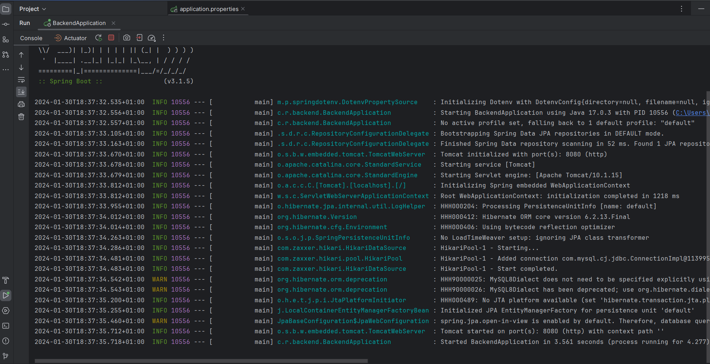
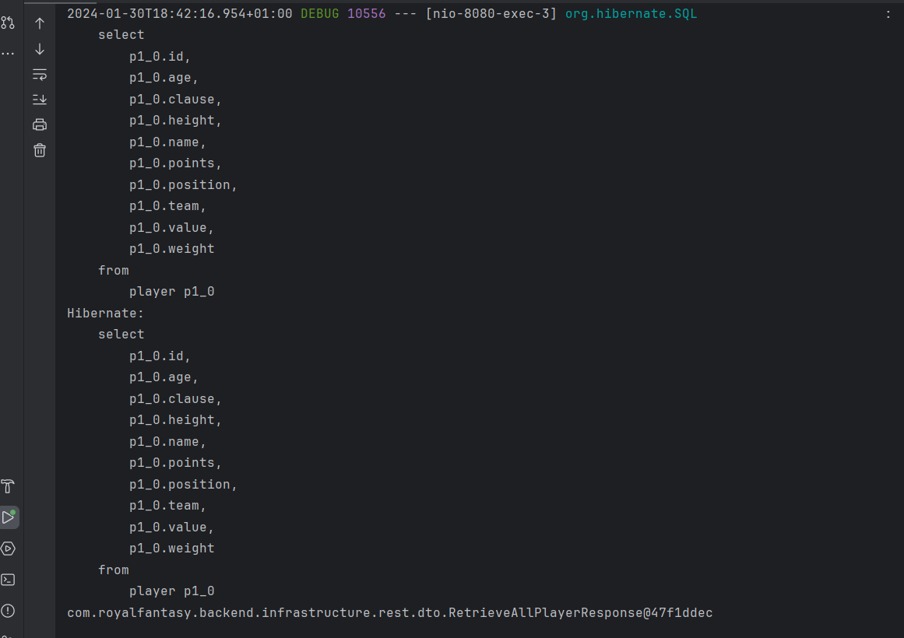
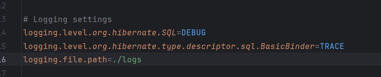
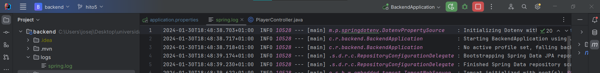

## Uso de logs
**Spring Boot** es un framework que nos permite visualizar los logs cada vez que ejecutamos y no necesitamos crear ningún tipo de configuración.

También está activado que conforme se vayan haciendo consultas a la base de datos, aparezcan como logs.

Por último, vamos a añadir que todos los logs se guarden en un fichero de logs como buena práctica para poder acceder a él en caso de que desaparezca la terminal o algo por el estilo.

Y se guardarían en este fichero:

