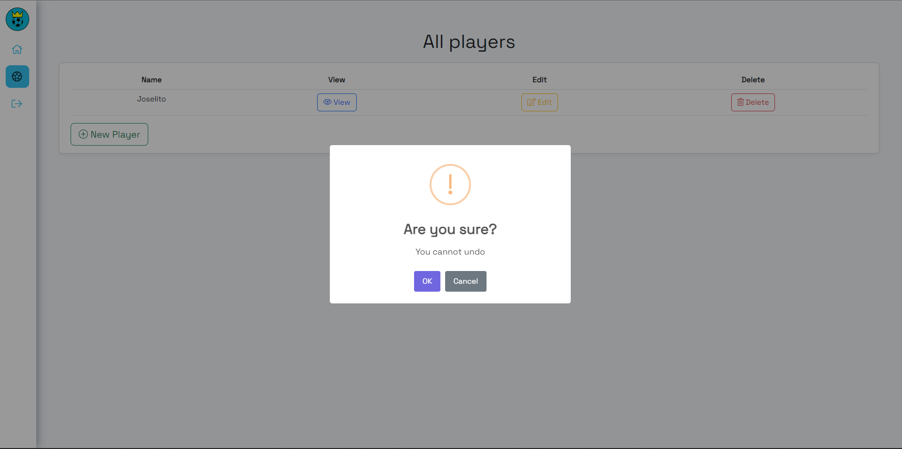

## Avance front-end
En este hito también se ha avanzado la parte frontal del sistema, implementado en Angular, y a continuación se pueden ver algunas de las pantallas o funcionalidades implementadas.

- [Inicio de sesión](#inicio-de-sesión)
- [Registro](#registro)
- [Home](#home)
- [Jugadores](#jugadores)
- [Ver jugador](#ver-jugador)
- [Crear jugador](#crear-jugador)
- [Editar jugador](#editar-jugador)
- [Eliminar jugador](#eliminar-jugador)
- [Cerrar sesión](#cerrar-sesión)

### Inicio de sesión

### Registro

### Home

### Jugadores

### Ver jugador

### Crear jugador

### Editar jugador

### Eliminar jugador

### Cerrar sesión

Mi objetivo en el próximo hito es que están pantallas creadas se puedan mejorar considerablemente.