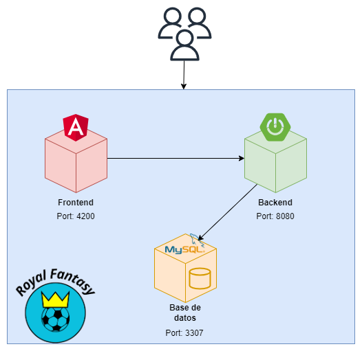

## Estructura del clúster
En este apartado se explicará la estructura del clúster de contenedores construido en este hito.

Se ha decidido alojar la lógica del sistema en tres contenedores principales, ilustrados en la siguiente imagen.

El primer contenedor (color rojo) hace referencia a la parte frontal del sistema, implementado usando **Angular**. Después tenemos el siguiente contenedor (color verde) que representa el backend de nuestro sistema y ha sido construido utilizando **Spring Boot**. Por último, tenemos el contendor de base de datos (color naranja) que se ha construido a partir de una base de datos **MySQL**.