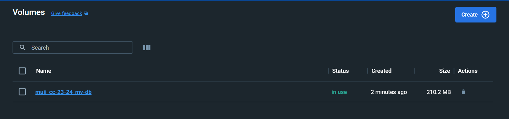
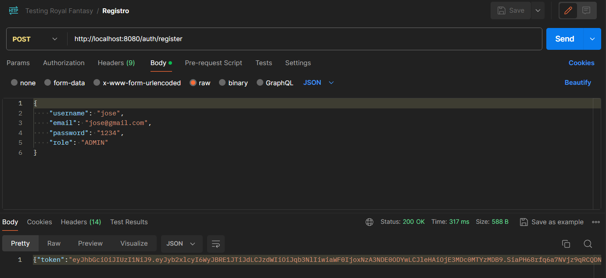
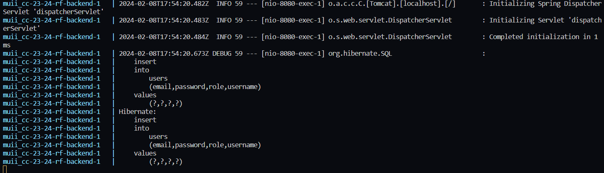
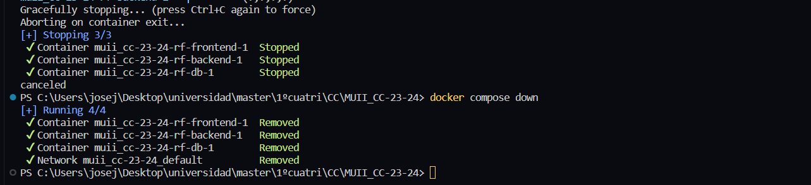

## Funcionamiento del clúster
En este apartado, se mostrará como poner en funcionamiento el sistema mediante algunos comandos y se verificará el correcto funcionamiento de los distintos servicios.

En primer lugar, debemos situarnos en la carpeta donde se encuentro nuestro fichero de composición del clúster (en mi caso, *docker-compose.yml*). Se presupone pero para que todo funcione correctamente debemos lanzar nuestro **Docker Desktop**.

Después debemos ejecutar el comando que lance la ejecución del docker compose:
```
docker compose up --build
```

Tras este comando, podremos observar que la composición de contenedores está ejecutandose en Docker Desktop, como se puede apreciar en la siguiente imagen.


También podremos apreciar como el volumen de la base de datos se ha creado correctamente.



Ahora podremos probar a realizar cualquier acción sobre nuestros contenedores y ver cómo todo funciona perfectamente. Por ejemplo, con Postman, realizaremos una petición al back que está alojado en el clúster, para ver que la petición se hace correctamente.




Esta consulta **POST** ha funcionado correctamente y se puede ver como en la consola donde se está ejecutando nuestro docker compose aparece la consulta en modo debug.

Para finalizar el clúster, podremos abortar su ejecución con la secuencia `ctrl + c` y ejecutar el comando consecutivamente `docker compose down` para destruir la composición.



